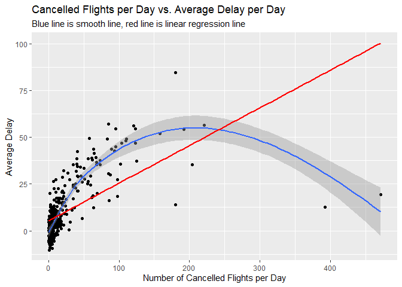

HW\_9-27
================
Nolan Wark
9/25/2022

\#Question 1

How many flights have a missing dep\_time?

``` r
filter(flights, is.na(dep_time)) %>% 
  summarise(num_missing = n())
```

    ## # A tibble: 1 x 1
    ##   num_missing
    ##         <int>
    ## 1        8255

8255

What other variables are
    missing?

``` r
names(which(colSums(is.na(flights))>0))
```

    ## [1] "dep_time"  "dep_delay" "arr_time"  "arr_delay" "tailnum"   "air_time"

What might these rows represent?

These row are most likely either canceled flights because there is no
depature time and no arrival time, or flights that had to change the
destination mid flight due to there being a departure time but not an
arrival time.

\#Question 2

Currently dep\_time and sched\_dep\_time are convenient to look at, but
hard to compute with because they’re not really continuous numbers.
Convert them to a more convenient representation of number of minutes
since midnight.

``` r
new_flights = flights %>% 
  mutate(dep_time = 60*(dep_time%/%100) + dep_time%%100,
         sched_dep_time = 60*(sched_dep_time%/%100) + sched_dep_time%%100)

new_flights
```

    ## # A tibble: 336,776 x 19
    ##     year month   day dep_time sched_dep_time dep_delay arr_time sched_arr_time
    ##    <int> <int> <int>    <dbl>          <dbl>     <dbl>    <int>          <int>
    ##  1  2013     1     1      317            315         2      830            819
    ##  2  2013     1     1      333            329         4      850            830
    ##  3  2013     1     1      342            340         2      923            850
    ##  4  2013     1     1      344            345        -1     1004           1022
    ##  5  2013     1     1      354            360        -6      812            837
    ##  6  2013     1     1      354            358        -4      740            728
    ##  7  2013     1     1      355            360        -5      913            854
    ##  8  2013     1     1      357            360        -3      709            723
    ##  9  2013     1     1      357            360        -3      838            846
    ## 10  2013     1     1      358            360        -2      753            745
    ## # ... with 336,766 more rows, and 11 more variables: arr_delay <dbl>,
    ## #   carrier <chr>, flight <int>, tailnum <chr>, origin <chr>, dest <chr>,
    ## #   air_time <dbl>, distance <dbl>, hour <dbl>, minute <dbl>, time_hour <dttm>

\#Question 3

Look at the number of canceled flights per day. Is there a pattern? Is
the proportion of canceled flights related to the average delay? Use
multiple dyplr operations, all on one line, concluding with
ggplot(aes(x= ,y=)) + geom\_point()

avg\_delay is the average of both departure delay and arrival delay
combined

``` r
flights %>% 
  mutate(month_day = paste(month, day, sep = "/")) %>% 
  group_by(month_day) %>% 
  summarise(num_cancelled = sum(is.na(dep_delay)),
            avg_delay = (sum(dep_delay, na.rm = TRUE) + sum(arr_delay, na.rm = TRUE)) / (sum(!is.na(dep_delay)) + sum(!is.na(arr_delay)))) %>% 
  ggplot(aes(x=num_cancelled, y=avg_delay)) + 
  geom_point() + 
  geom_smooth() + 
  geom_smooth(method = 'lm', color='red', se=FALSE) + 
  labs(x='Number of Cancelled Flights per Day', y ='Average Delay', title = 'Cancelled Flights per Day vs. Average Delay per Day', subtitle = 'Blue line is smooth line, red line is linear regression line')
```

    ## `geom_smooth()` using method = 'loess' and formula 'y ~ x'

    ## `geom_smooth()` using formula 'y ~ x'

<!-- -->

There is a positive correlation between the number of cancelled flights
per day and the average delay. The correlation looks to be logarithmic.
